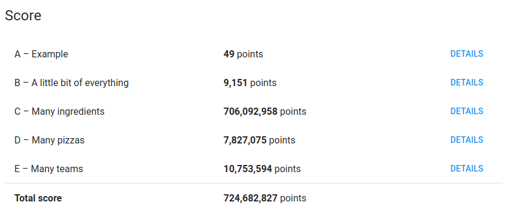

# Google-Hash-Code-Practice-Round


Our naive solution for the Practice Round.

## Main idea
This solution proposes to first select the largest team that can be served with 
the current amount of pizzas, then greedily selecting the pizzas whose toppings
are the least overlapping.

## Usage
```sh
python3 prova_pizza_hashcode.py
```

## Score


## Authors<br>
N.B: Alphabetical order <--> fair contribution
*   **Andrea Bacciu**  - [github](https://github.com/andreabac3)
*   **Emanuele Giona**  - [github](https://github.com/emanuelegiona)
*   **Alessandro Scandone**  - [github](https://github.com/ascandone)
*   **Riccardo Taiello**  - [github](https://github.com/Riccardinho22)
